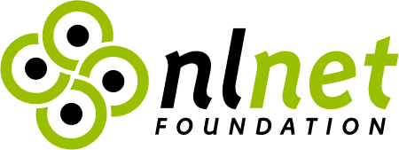
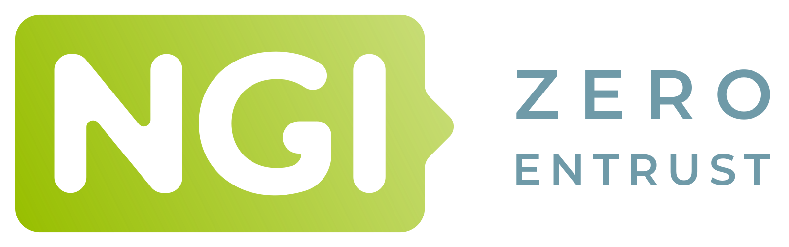

# Marginalia Search

This is the source code for [Marginalia Search](https://search.marginalia.nu). 

The aim of the project is to develop new and alternative discovery methods for the Internet. 
It's an experimental workshop as much as it is a public service, the overarching goal is to
elevate the more human, non-commercial sides of the Internet.

A side-goal is to do this without requiring datacenters and enterprise hardware budgets, 
to be able to run this operation on affordable hardware with minimal operational overhead. 

The long term plan is to refine the search engine so that it provide enough public value 
that the project can be funded through grants, donations and commercial API licenses 
(non-commercial share-alike is always free).

## Set up

Start by running [⚙️ run/setup.sh](run/setup.sh). This will download supplementary model data that is necessary to run the code. 
These are also necessary to run the tests. 

To set up a local test environment, follow the instructions in [📄 run/readme.md](run/readme.md)!

## Hardware Requirements

A production-like environment requires at least 128 Gb of RAM and ideally 2 Tb+ of enterprise 
grade SSD storage, as well as some additional terabytes of slower harddrives for storing crawl
data. It can be made to run on smaller hardware by limiting size of the index. 

A local developer's deployment is possible with much smaller hardware (and index size). 

## Project Structure

[📁 code/](code/) - The Source Code. See [📄 code/readme.md](code/readme.md) for a further breakdown of the structure and architecture.

[📁 run/](run/) - Scripts and files used to run the search engine locally

[📁 third-party/](third-party/) - Third party code

[📁 doc/](doc/) - Supplementary documentation

[📄 CONTRIBUTING.md](CONTRIBUTING.md) - How to contribute

[📄 LICENSE.md](LICENSE.md) - License terms

## Contact

You can email <kontakt@marginalia.nu> with any questions or feedback.

## License

The bulk of the project is available with AGPL 3.0, with exceptions. Some parts are co-licensed under MIT, 
third party code may have different licenses. See the appropriate readme.md / license.md.

## Funding

### Donations

Consider [donating to the project](https://www.marginalia.nu/marginalia-search/supporting/).

### Grants

This project was funded through the [NGI0 Entrust Fund](https://nlnet.nl/entrust), a fund established by [NLnet](https://nlnet.nl) with financial support from the European Commission's [Next Generation Internet](https://ngi.eu/) programme, under the aegis of DG Communications Networks, Content and Technology under grant agreement No 101069594.

