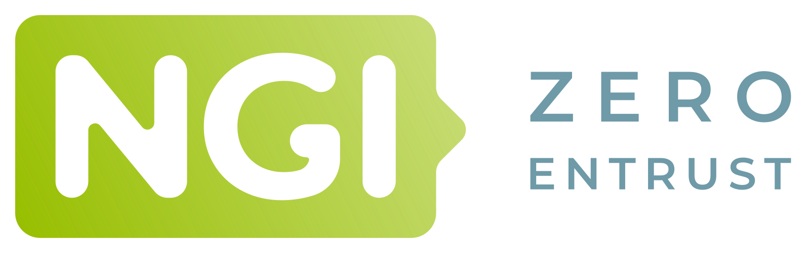
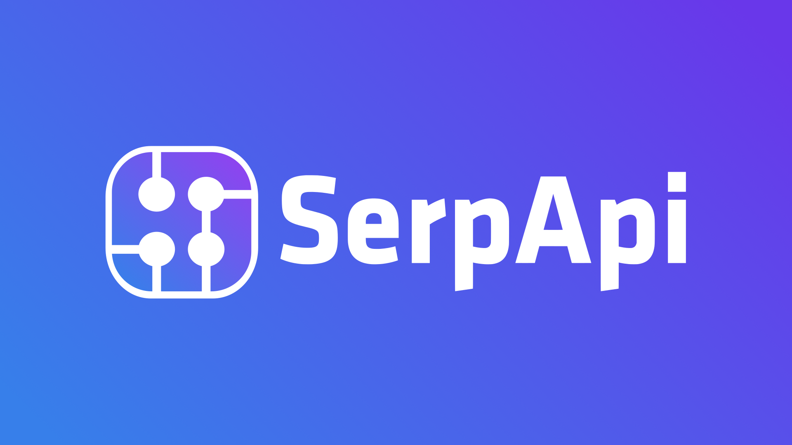

# Marginalia Search

This is the source code for [Marginalia Search](https://search.marginalia.nu). 

The aim of the project is to develop new and alternative discovery methods for the Internet. 
It's an experimental workshop as much as it is a public service, the overarching goal is to
elevate the more human, non-commercial sides of the Internet.

A side-goal is to do this without requiring datacenters and enterprise hardware budgets, 
to be able to run this operation on affordable hardware with minimal operational overhead. 

The long term plan is to refine the search engine so that it provide enough public value 
that the project can be funded through grants, donations and commercial API licenses 
(non-commercial share-alike is always free).

The system can both be run as a copy of Marginalia Search, or as a white-label search engine
for your own data (either crawled or side-loaded).  At present the logic isn't very configurable, and a lot of the judgements
made are based on the Marginalia project's goals, but additional configurability is being
worked on!

Here's a demo of the set-up and operation of the self-hostable barebones mode of the search engine: [🌎&nbsp;https://www.youtube.com/watch?v=PNwMkenQQ24](https://www.youtube.com/watch?v=PNwMkenQQ24)

## Set up

To set up a local test environment, follow the instructions in [📄 run/readme.md](run/readme.md)!

Further documentation is available at [🌎&nbsp;https://docs.marginalia.nu/](https://docs.marginalia.nu/).

Before compiling, it's necessary to run [⚙️ run/setup.sh](run/setup.sh). 
This will download supplementary model data that is necessary to run the code. 
These are also necessary to run the tests. 

If you wish to hack on the code, check out [📄&nbsp;doc/ide-configuration.md](doc/ide-configuration.md).

## Hardware Requirements

A production-like environment requires a lot of RAM and ideally enterprise SSDs for
the index, as well as some additional terabytes of slower harddrives for storing crawl
data. It can be made to run on smaller hardware by limiting size of the index.  

The system will definitely run on a 32 Gb machine, possibly smaller, but at that size it may not perform
very well as it relies on disk caching to be fast. 

A local developer's deployment is possible with much smaller hardware (and index size). 

## Project Structure

[📁 code/](code/) - The Source Code. See [📄 code/readme.md](code/readme.md) for a further breakdown of the structure and architecture.

[📁 run/](run/) - Scripts and files used to run the search engine locally

[📁 third-party/](third-party/) - Third party code

[📁 doc/](doc/) - Supplementary documentation

[📄 CONTRIBUTING.md](CONTRIBUTING.md) - How to contribute

[📄 LICENSE.md](LICENSE.md) - License terms

## Contact

You can email <kontakt@marginalia.nu> with any questions or feedback.

## License

The bulk of the project is available with AGPL 3.0, with exceptions. Some parts are co-licensed under MIT, 
third party code may have different licenses. See the appropriate readme.md / license.md.

# Donations, Sponsorships, and Grants

Consider [donating to the project](https://about.marginalia-search.com/article/supporting/).

## Grant: NLnet / NGI0 Entrust Fund

This project was funded through the [NGI0 Entrust Fund](https://nlnet.nl/entrust), a fund established by [NLnet](https://nlnet.nl) with financial support from the European Commission's [Next Generation Internet](https://ngi.eu/) programme, under the aegis of DG Communications Networks, Content and Technology under grant agreement No 101069594.

 

## Sponsorship: SerpApi

The project received a sponsorship from SerpApi.

[SerpApi's Search Index API](https://serpapi.com/marginalia-search): Real-time web data for AI agents. SerpApi's Search Index API delivers fresh, structured results in JSON and Markdown, alongside a core API for public search engine results across Google, DuckDuckGo, Bing, YouTube, Amazon, and more.
