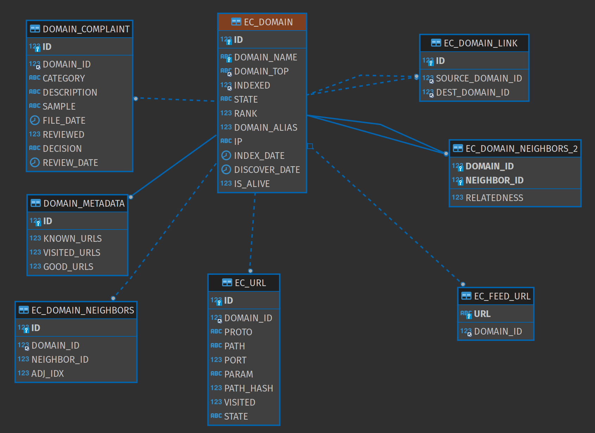
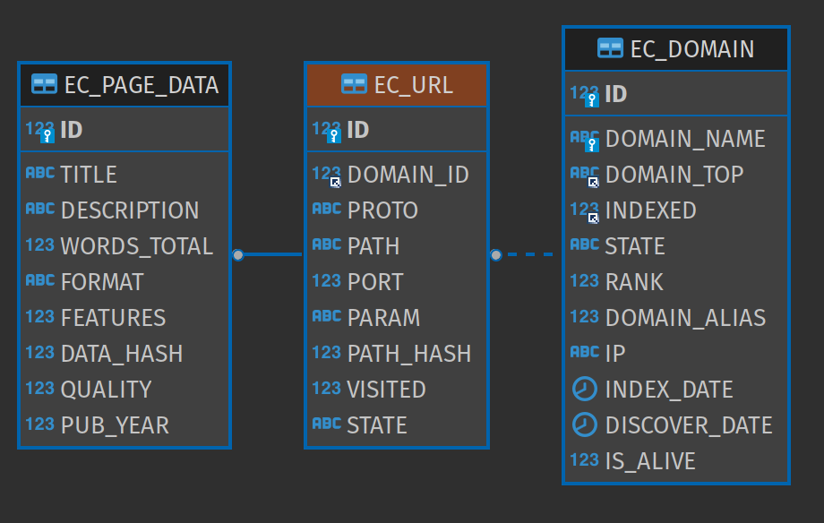

# DB

This module primarily contains SQL files for the URLs database. The most central tables are `EC_DOMAIN`, `EC_URL` and `EC_PAGE_DATA`.

## Central Paths

* [current](src/main/resources/sql/current) - The current database model
* [migrations](src/main/resources/sql/migrations)

## See Also 

* [common/service](../service) implements DatabaseModule, which is from where the services get database connections.

## Relation diagrams for EC_DOMAIN and EC_URL

