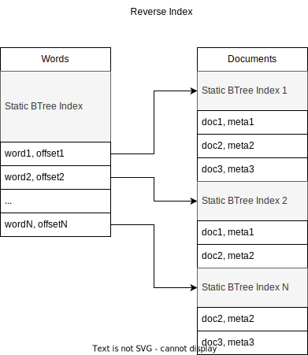

# Reverse Index

The reverse index contains a mapping from word to document id. 

There are two tiers of this index.

* A priority index which only indexes terms that are flagged with priority flags1.
* A full index that indexes all terms. 

The full index also provides access to term-level metadata, while the priority index is a binary index that only offers information about which documents has a specific word.

[1] See WordFlags in [common/model](../../common/model/) and
KeywordMetadata in [features-convert/keyword-extraction](../../features-convert/keyword-extraction).

## Construction

The reverse index is constructed by first building a series of preindexes.
Preindexes consist of a Segment and a Documents object.  The segment contains
information about which word identifiers are present and how many, and the
documents contain information about in which documents the words can be found.

These would typically not fit in RAM, so the index journal is paged 
and the preindexes are constructed small enough to fit in memory, and
then merged.  Merging sorted arrays is a very fast operation that does
not require additional RAM.

Once merged into  one large preindex, indexes are added to the preindex data
to form a finalized reverse index. 

## Central Classes

* [ReversePreindex](src/main/java/nu/marginalia/index/construction/ReversePreindex.java) intermediate reverse index state.
* [ReverseIndexConstructor](src/main/java/nu/marginalia/index/construction/ReverseIndexConstructor.java) constructs the index.
* [ReverseIndexReader](src/main/java/nu/marginalia/index/ReverseIndexReader.java) interrogates the index.

## See Also

* [index-journal](../index-journal)
* [index-forward](../index-forward)
* [libraries/btree](../../libraries/btree)
* [libraries/array](../../libraries/array)