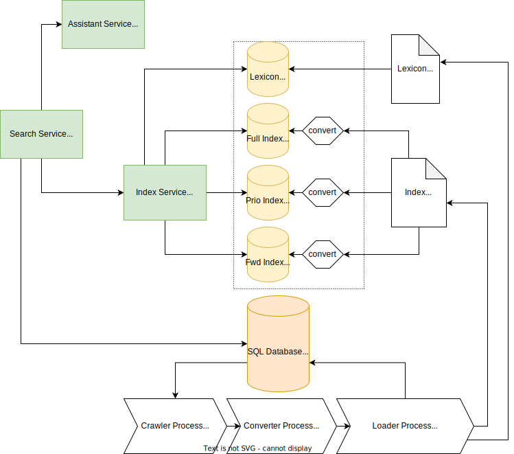

# Code

This is a pretty large and diverse project with many moving parts. 
You'll find a short description in each module of what it does and how it relates to other modules.

## Overview

A map of the most important components and how they relate can be found below. 

### Services
* [core services](services-core/) "macroservices", stateful, memory hungry doing heavy lifting.
* * [search](services-core/search-service)
* * [index](services-core/index-service)
* * [assistant](services-core/assistant-service)
* [sattelite services](services-satellite/) "microservices", stateless providing additional functionality.
* * [api](services-satellite/api-service)  - public API
* * [dating](services-satellite/dating-service)  - [https://explore.marginalia.nu/](https://explore.marginalia.nu/)
* * [explorer](services-satellite/explorer-service)  - [https://explore2.marginalia.nu/](https://explore2.marginalia.nu/)
* an [internal API](api/)

### Processes

Processes are batch jobs that deal with data retrieval, processing and loading.

* [processes](processes/)
* * [crawling-process](processes/crawling-process)
* * [converting-process](processes/converting-process)
* * [loading-process](processes/loading-process)

#### Tools

* * [crawl-job-extractor](tools/crawl-job-extractor)
* * [term-frequency-extractor](tools/term-frequency-extractor)

### Features

Features are relatively stand-alone components that serve some part of the domain. They aren't domain-independent,
but isolated. 

* [features-search](features-search)
* [features-crawl](features-crawl)
* [features-convert](features-convert)
* [features-index](features-index)

### Libraries and primitives

Libraries are stand-alone code that is independent of the domain logic.  

* [common](common/) elements for creating a service, a client etc.
* [libraries](libraries/) containing non-search specific code.
* * [array](libraries/array/) - large memory mapped area library 
* * [btree](libraries/btree/) - static btree library
