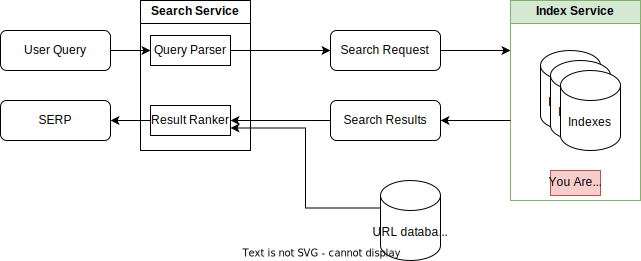

The index service is a partitioned service that knows which document contains which keywords.

It is the service that most directly executes a search query.  It does this by
evaluating a low-level query, and then using the index to find the documents 
that match the query, finally ranking the results and picking the best matches.

This module only contains service boilerplate. The guts of this service are 
in the [index](../../index) module.

