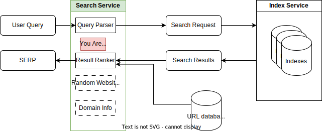

# Search Service

This service handles search traffic and is the service
you're most directly interacting with when visiting
[search.marginalia.nu](https://search.marginalia.nu). 

It interprets a "human" query and translates it into a
request that gets passed into to the index service, which finds
related documents, which this service then ranks and returns
to the user.

## Central classes

* [SearchService](src/main/java/nu/marginalia/search/SearchService.java) receives requests and delegates to the 
appropriate services.

* [CommandEvaluator](src/main/java/nu/marginalia/search/command/CommandEvaluator.java) interprets a user query and acts
upon it, dealing with special operations like `browse:` or `site:`.

* [QueryFactory](src/main/java/nu/marginalia/search/query/QueryFactory.java) parses a search query into a machine readable query specification.

* [SearchQueryIndexService](src/main/java/nu/marginalia/search/svc/SearchQueryIndexService.java) passes a parsed search query to the index service, and
then decorates the search results so that they can be rendered.

## See Also

* [features-search](../../features-search/)
