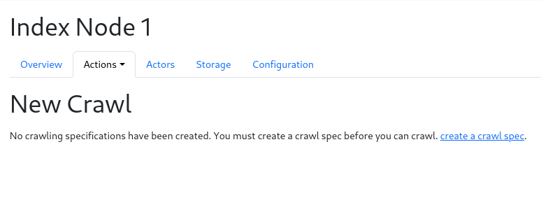
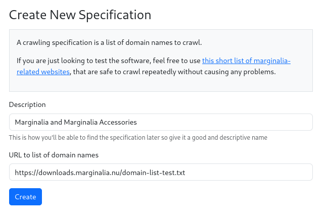
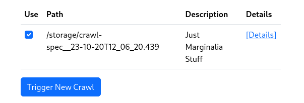
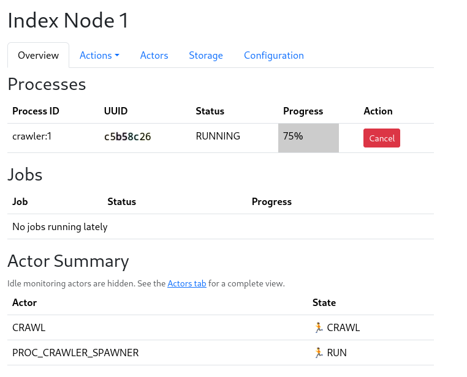
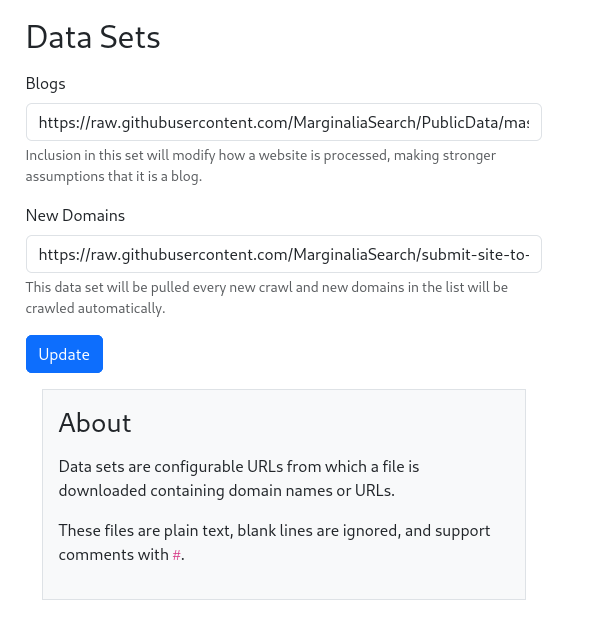

# Crawling

This document is a draft.

## WARNING

Please don't run the crawler unless you intend to actually operate a public
facing search engine!  For testing, use crawl sets from [downloads.marginalia.nu](https://downloads.marginalia.nu/) instead;
or if you wish to play with the crawler, crawl a small set of domains from people who are
ok with it, use your own, your friends, or any subdomain from marginalia.nu.

See the documentation in run/ for more information on how to load sample data! 

Reckless crawling annoys webmasters and makes it harder to run an independent search engine. 
Crawling from a domestic IP address is also likely to put you on a greylist
of probable bots.  You will solve CAPTCHAs for almost every website you visit
for weeks, and may be permanently blocked from a few IPs.

## Prerequisites

You probably want to run a local bind resolver to speed up DNS lookups and reduce the amount of
DNS traffic. 

These processes require a lot of disk space.  It's strongly recommended to use a dedicated disk for
the index storage subdirectory, it doesn't need to be extremely fast, but it should be a few terabytes in size.  

It should be mounted with `noatime`.  It may be a good idea to format the disk with a block size of 4096 bytes.  This will reduce the amount of disk space used by the crawler.

Make sure you configure the user-agent properly.  This will be used to identify the crawler,
and is matched against the robots.txt file.  The crawler will not crawl sites that don't allow it.
See [wiki://Robots_exclusion_standard](https://en.wikipedia.org/wiki/Robots_exclusion_standard) for more information
about robots.txt; the user agent can be configured in conf/properties/system.properties; see the 
[system-properties](system-properties.md) documentation for more information.

## Setup

Ensure that the system is running and go to https://localhost:8081.  

With the default test configuration, the system is configured to 
store data in `node-1/storage`.

## Fresh Crawl

While a running search engine can use the link database to figure out which websites to visit, a clean
system does not know of any links.  To bootstrap a crawl, a crawl specification needs to be created to 
seed the domain database.

Go to `Nodes->Node 1->Actions->New Crawl`

Click the link that says 'New Spec' to arrive at a form for creating a new specification:

Fill out the form with a description and a link to a domain list.  The domain list is a text file
with one domain per line, with blank lines and comments starting with `#` ignored.  You can use
github raw links for this purpose.  For test purposes, you can use this link:
`https://downloads.marginalia.nu/domain-list-test.txt`, which will create a crawl for a few
of marignalia.nu's subdomains.

If you aren't redirected there automatically, go back to the `New Crawl` page under Node 1 -> Actions. 
Your new specification should now be listed.  

Check the box next to it, and click `[Trigger New Crawl]`.

This will start the crawling process.  Crawling may take a while, depending on the size
of the domain list and the size of the websites.  

Eventually a process bar will show up, and the crawl will start.  When it reaches 100%, the crawl is done.
You can also monitor the `Events Summary` table on the same page to see what happened after the fact.

It is expected that the crawl will stall out toward the end  of the process, this is a statistical effect since
the largest websites take the longest to finish, and tend to be the ones lingering at 99% or so completion.  The
crawler has a timeout of 5 hours, where if no new domains are finished crawling, it will stop, to prevent crawler traps
from stalling the crawl indefinitely. 

**Be sure to read the section on re-crawling!**

## Converting

Once the crawl is done, the data needs to be processed before its searchable.  This is done by going to
`Nodes->Node 1->Actions->Process Crawl Data`.

[screenshot here]

This will start the conversion process.  This will again take a while, depending on the size of the crawl. 
The process bar will show the progress.  When it reaches 100%, the conversion is done, and the data will begin
loading automatically.  A cascade of actions is performed in sequence, leading to the data being loaded into the
search engine and an index being constructed.  This is all automatic, but depending on the size of the crawl data,
may take a while.

When an event `INDEX-SWITCH-OK` is logged in the `Event Summary` table, the data is ready to be searched.

## Re-crawling

The work flow with a crawl spec was a one-off process to bootstrap the search engine.  To keep the search engine up to date,
it is preferable to do a recrawl.  This will try to reduce the amount of data that needs to be fetched.

To trigger a Recrawl, go to `Nodes->Node 1->Actions->Re-crawl`.  This will bring you to a page that looks similar to the
first crawl page, where you can select a set of crawl data to use as a source.  Select the crawl data you want, and
press `[Trigger Recrawl]`. 

Crawling will proceed as before, but this time, the crawler will try to fetch only the data that has changed since the
last crawl, increasing the number of documents by a percentage.  This will typically be much faster than the initial crawl.  

### Growing the crawl set

The re-crawl will also pull new domains from the `New Domains` dataset, which is an URL configurable in
`[Top Menu] -> System -> Data Sets`.  If a new domain is found, it will be assigned to the present node, and crawled in
the re-crawl.

