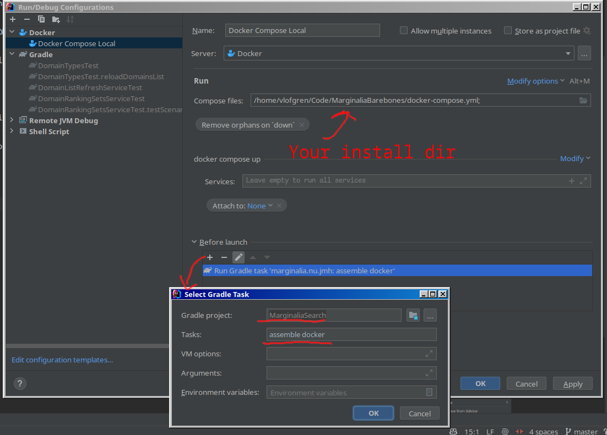
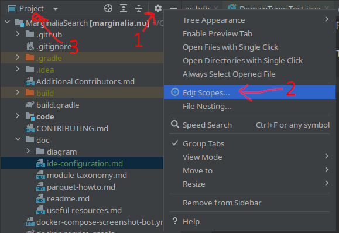

It is strongly recommended you use [IntelliJ IDEA](https://www.jetbrains.com/idea/download), as it's the IDE the 
project is developed in. Use the free Community Edition if you don't have (or want) a commercial license.  It is 
more than capable. 

It may be possible to use other IDEs, but the code uses a relatively advanced build system and some IDEs get very 
confused by this.

## JDK 21 (+preview)
The codebase uses Java 21 preview features.  You may need to configure your IDE to use Java 21, or set the language version to 21 (preview).  Usually it's 
smart enough to figure it out, but sometimes it's not.

Go to `File > Project Structure > Project`, ensure it's set to use a JDK21 SDK, and set the Project SDK to 21 (preview).

## Lombok, other plugins

The codebase uses Lombok. To prevent the IDE from finding fault with the code, you need to install the Lombok plugin.

You may also want protobuf and docker plugins, although this is optional.

## Running

It makes life a lot easier to set up a docker-compose run configuration in IntelliJ.  Configure it like this:

Select the docker-compose file from your install directory, and then add a 'Before Launch' gradle task
to build the project.  It should run 'assemble docker'.  Then you can just run the configuration and
it will build and run the project (e.g. Shift+F10).

## Optional: Use Scopes

Since the project is sprawling with submodules, it can help sanity to use IDE scopes. 
In IntelliJ, you can click the little cog in the top of the side-bar (1), then select `Edit Scopes` (2).
Create a scope with the components you want to work with, and then it shows up in the drop-down (3).

