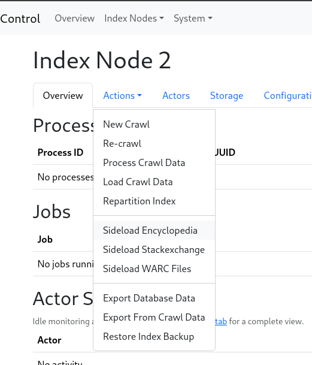
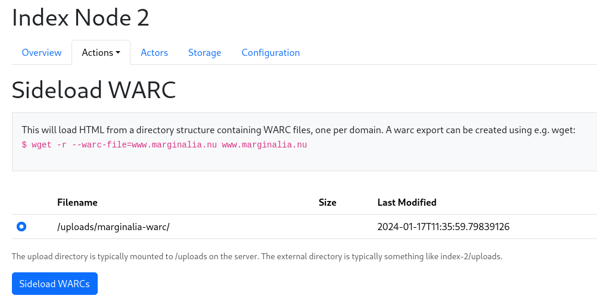
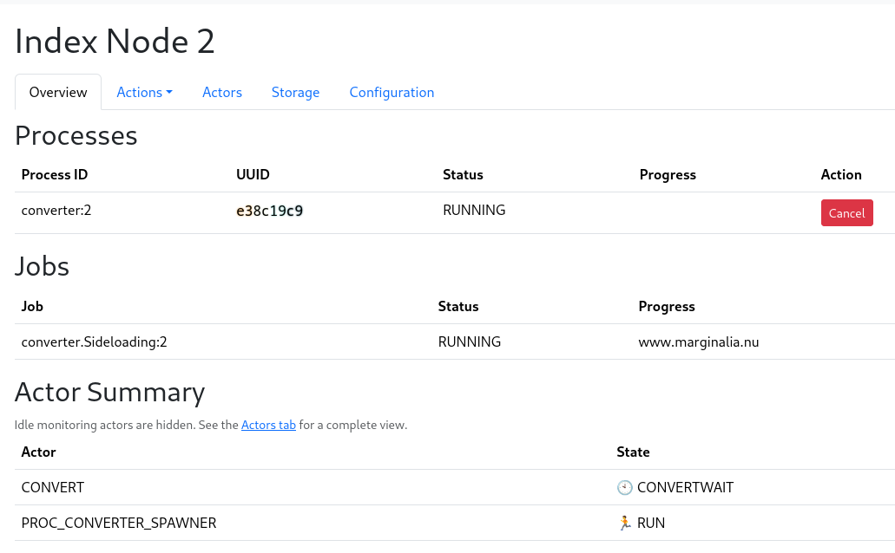
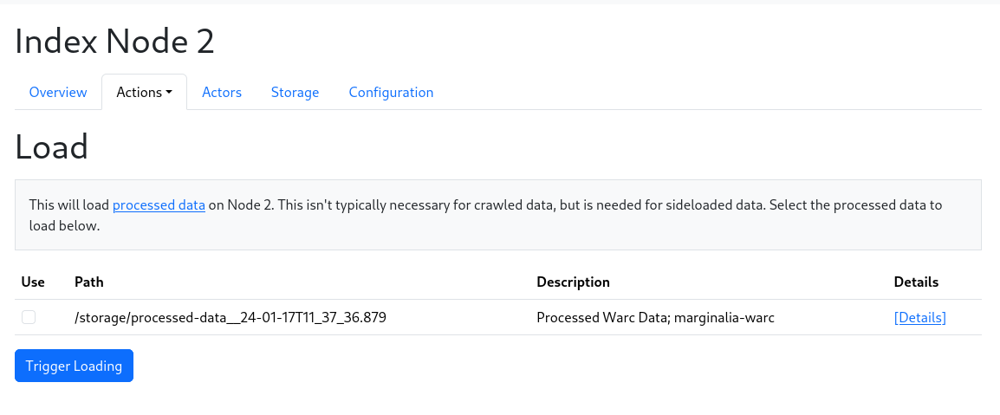

# Sideloading How-To

Some websites are much larger than others, this includes
Wikipedia, Stack Overflow, and a few others.  They are so
large they are impractical to crawl in the traditional fashion,
but luckily they make available data dumps that can be processed
and loaded into the search engine through other means.

To this end, it's possible to sideload data into the search engine
from other sources than the web crawler.

## Index Nodes

In practice, if you want to sideload data, you need to do it on
a separate index node.  Index nodes are separate instances of the
index software.  The default configuration is to have two index nodes,
one for the web crawler, and one for sideloaded data.  

The need for a separate node is due to incompatibilities in the work flows.

It is also a good idea in general, as very large domains can easily be so large that the entire time budget 
for the query is spent sifting through documents from that one domain, this is 
especially true with something like Wikipedia, which has a lot of documents at 
least tangentially related to any given topic.

This how-to assumes that you are operating on index-node 2.  

## Notes on the upload directory

This is written assuming that the system is installed with the `install.sh`
script, which deploys the system with docker-compose, and has a directory 
structure like

```
...
index-1/backup/
index-1/index/
index-1/storage/
index-1/uploads/
index-1/work/
index-2/backup/
index-2/index/
index-2/storage/
index-2/uploads/
index-2/work/
...
```

We're going to be putting files in the **uploads** directories.   If you have installed
the system in some other way, or changed the configuration significantly, you need
to adjust the paths accordingly.

## Sideloading

The sideloading actions are available through Actions menu in each node.



## Sideloading WARCs

WARC files are the standard format for web archives.  They can be created e.g. with wget.
The Marginalia software can read WARC files directly, and sideload them into the index,
as long as each warc file contains only one domain.

Let's for example archive www.marginalia.nu (I own this domain, so feel free to try this at home)

```bash
$  wget -r --warc-file=marginalia www.marginalia.nu
```

**Note** If you intend to do this on other websites, you should probably add a `--wait` parameter to wget,
e.g. `wget --wait=1 -r --warc-file=...` to avoid hammering the website with requests and getting blocked.

This will take a moment, and create a file called `marginalia.warc.gz`. We move it to the
upload directory of the index node, and sideload it through the Actions menu.

```bash
$ mkdir -p index-2/uploads/marginalia-warc
$ mv marginalia.warc.gz index-2/uploads/marginalia-warc
```

Go to the Actions menu, and select the "Sideload WARC" action.  This will show a list of
subdirectories in the Uploads directory.  Select the directory containing the WARC file, and
click "Sideload".



This should take you to the node overview, where you can see the progress of the sideloading.
It will take a moment, as the WARC file is being processed.  



It will not be loaded automatically.  This is to permit you to sideload multiple sources.

When you are ready to load it, go to the Actions menu, and select "Load Crawl Data".



Select all the sources you want to load, and click "Load".  This will load the data into the
index, and make it available for searching.  

## Sideloading Wikipedia

Due to licensing incompatibilities with OpenZim's GPL-2 and AGPL, the workflow 
depends on using the conversion process from [https://encyclopedia.marginalia.nu/](https://encyclopedia.marginalia.nu/)
to pre-digest the data.  

Build the [encyclopedia.marginalia.nu Code](https://github.com/MarginaliaSearch/encyclopedia.marginalia.nu)
and follow the instructions for downloading a ZIM file, and then run something like

```$./encyclopedia convert file.zim articles.db```

This db-file can be processed and loaded into the search engine through the
Actions view.

FIXME: It will currently only point to en.wikipedia.org, this should be
made configurable.


## Sideloading a directory tree

For relatively small websites, ad-hoc side-loading is available directly from a
folder structure on the hard drive. This is intended for loading manuals, 
documentation and similar data sets that are large and slowly changing.

A website can be archived with wget, like this

```bash
UA="search.marginalia.nu" \
DOMAIN="www.example.com" \
wget -nc -x --continue -w 1 -r -U ${UA} -A "html" ${DOMAIN}
```

After doing this to a bunch of websites, create a YAML file something like this:

```yaml
sources:
- name: jdk-20
  dir: "jdk-20/"
  domainName: "docs.oracle.com"
  baseUrl: "https://docs.oracle.com/en/java/javase/20/docs"
  keywords:
  - "java"
  - "docs"
  - "documentation"
  - "javadoc"
- name: python3
  dir: "python-3.11.5/"
  domainName: "docs.python.org"
  baseUrl: "https://docs.python.org/3/"
  keywords:
  - "python"
  - "docs"
  - "documentation"
- name: mariadb.com
  dir: "mariadb.com/"
  domainName: "mariadb.com"
  baseUrl: "https://mariadb.com/"
  keywords:
  - "sql"
  - "docs"
  - "mariadb"
  - "mysql"
```

|parameter|description|
|----|----|
|name|Purely informative|
|dir|Path of website contents relative to the location of the yaml file|
|domainName|The domain name of the website|
|baseUrl|This URL will be prefixed to the contents of `dir`|
|keywords|These supplemental keywords will be injected in each document|

The directory structure corresponding to the above might look like

```
docs-index.yaml
jdk-20/
jdk-20/resources/
jdk-20/api/
jdk-20/api/[...]
jdk-20/specs/
jdk-20/specs/[...]
jdk-20/index.html
mariadb.com
mariadb.com/kb/
mariadb.com/kb/[...]
python-3.11.5
python-3.11.5/genindex-B.html
python-3.11.5/library/
python-3.11.5/distutils/
python-3.11.5/[...]
[...]
```

This yaml-file can be processed and loaded into the search engine through the
Actions view.


## Sideloading Stack Overflow/Stackexchange

Stackexchange makes dumps available on Archive.org.  These are unfortunately on a format that 
needs some heavy-handed pre-processing before they can be loaded.  A tool is available for 
this in [tools/stackexchange-converter](../code/tools/stackexchange-converter).

After running `gradlew dist`, this tool is found in `build/dist/stackexchange-converter`,
follow the instructions in the stackexchange-converter readme, and
convert the stackexchange xml.7z-files to sqlite db-files. 

A directory with such db-files can be processed and loaded into the 
search engine through the Actions view.